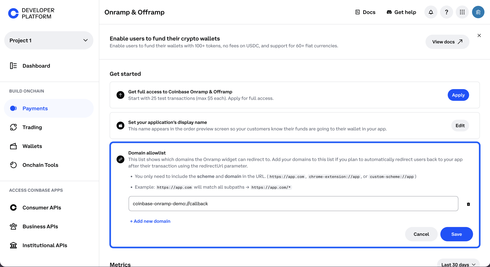
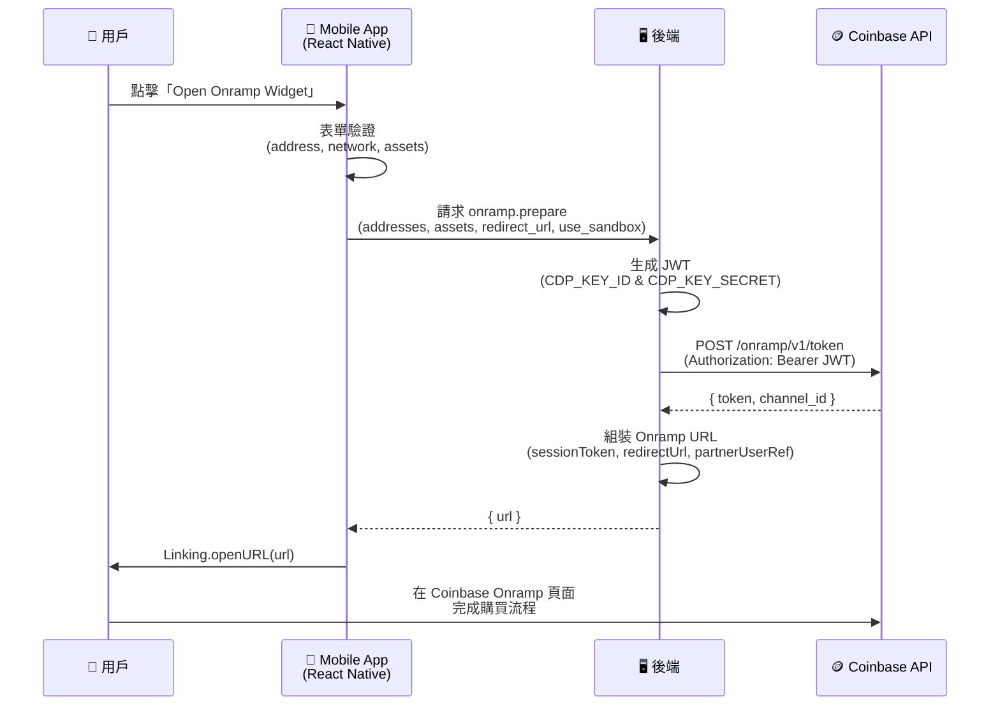
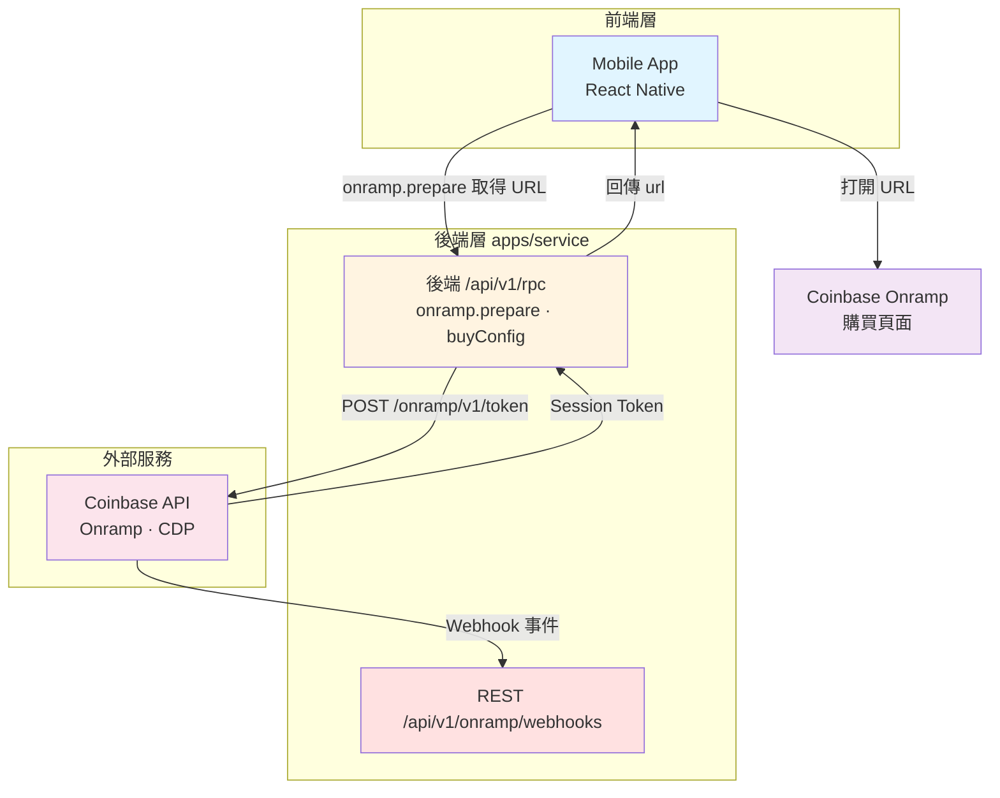
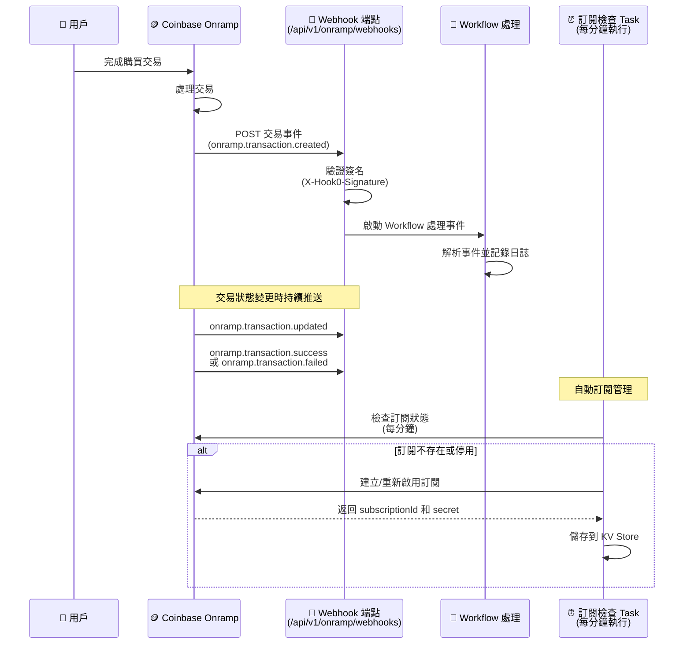

# CoinBase Onramp Demo

## 文件參考

- [Welcome to Onramp & Offramp](https://docs.cdp.coinbase.com/onramp-&-offramp/introduction/welcome)
- [Demo Repo](https://github.com/Chia1104/coinbase-onramp-demo)

## 事前準備

這裡需要先在 [CDP](https://portal.cdp.coinbase.com/) (Coinbase Develop Platform) 建立一個專案，同時在建立一組 API Key，並設定這兩組資訊：

- `CDP_KEY_ID`
- `CDP_KEY_SECRET`

> 請參考官方文檔：[Getting Started with Onramp](https://docs.cdp.coinbase.com/onramp-&-offramp/introduction/getting-started#step-1:-sign-up-for-a-cdp-account)

並新增允許 Redirect domain allowlist

## 流程

### 架構流程圖

### 架構說明

### 需要實作的 API

| API                  | 路徑／用途                     | 說明                                                                                                                                                           |
| -------------------- | ------------------------------ | -------------------------------------------------------------------------------------------------------------------------------------------------------------- |
| **onramp.prepare**   | 後端 RPC                       | 入參：addresses、assets、redirect_url、use_sandbox。向 Coinbase 取得 session token 後組裝 Onramp URL，回傳 `{ url }`。redirect_url 須在 CDP Domain Allowlist。 |
| **onramp.buyConfig** | 後端 RPC                       | 取得國家與支付方式設定，供前端選單使用（可選）。                                                                                                               |
| **Webhook**          | `POST /api/v1/onramp/webhooks` | 接收 Coinbase 交易狀態事件，驗證簽名後異步處理（見下方 Webhook 章節）。                                                                                        |

### 前端流程

1. **觸發**：用戶填寫錢包地址、網路、資產後，點擊開啟 Onramp。
2. **取得 URL**：前端呼叫後端 **onramp.prepare**，傳入 addresses、assets、redirect_url、use_sandbox；後端回傳 Onramp 完整 URL。
3. **導向**：前端以回傳的 URL 開啟瀏覽器／WebView，用戶在 Coinbase Onramp 頁面完成購買。
4. **返回**：完成後依 redirect_url 回到 App（如 onramp-callback）；交易狀態由 Webhook 推送到後端。

### partnerUserRef 整合

**partnerUserRef** 用來在 Webhook 裡對應「這筆交易」是哪一次開啟 Onramp、或哪一位用戶，方便後端做入帳、通知或風控。

| 階段     | 說明                                                                                                                         |
| -------- | ---------------------------------------------------------------------------------------------------------------------------- |
| **產生** | 後端在 **onramp.prepare** 組裝 Onramp URL 時，為「這次開啟 Onramp」產生一組唯一值（本專案使用 UUID）。                       |
| **傳遞** | 將 `partnerUserRef` 寫入 Onramp URL 的 query（`partnerUserRef=xxx`），使用者到 Coinbase 完成購買時，Coinbase 會原樣保留。    |
| **回傳** | Coinbase 在每個 Webhook 事件 payload 中帶回 `partnerUserRef`，後端可從 `webhookData.partnerUserRef` 取得，與產生時的值一致。 |

**與自家用戶對應（可選）**：若要在 Webhook 裡辨識「是哪個登入用戶」或「哪一筆訂單」，可在 prepare 當下把 `partnerUserRef` 與你的 `userId`／`orderId` 存進 DB 或 KV；收到 Webhook 時用 `partnerUserRef` 查表即可。本專案後端支援透過 context 的 `onPrepareOnrampUrl` hook 在回傳 URL 前拿到 `partnerUserRef`，可在此 hook 內寫入儲存邏輯。

### Webhook

#### 概述

Webhooks 提供即時的交易狀態更新通知。當用戶完成購買交易後，Coinbase 會主動推送交易狀態變更事件到我們設定的 Webhook 端點，讓後端能夠即時同步交易狀態，無需主動輪詢查詢。

> 在沙盒環境測試時，位於 [pay-sandbox.coinbase.com](http://pay-sandbox.coinbase.com/) 的 Onramp 沙盒可支援測試訪客結帳流程。
>
> 請注意：CDP 支付 API 沙盒不支援 webhook（webhook 僅在正式環境可用）。
>
> 測試替代方案：可在沙盒測試期間使用「[取得所有](https://docs.cdp.coinbase.com/api-reference/rest-api/onramp-offramp/get-all-onramp-transactions)入金交易 API」或「依 ID[取得入金](https://docs.cdp.coinbase.com/api-reference/rest-api/onramp-offramp/get-onramp-transactions-by-id)交易 API」來輪詢交易狀態。

#### Webhook 流程圖

#### 實作架構

##### 1. Webhook 接收端點

- **路徑**：`POST /api/v1/onramp/webhooks`
- **簽名驗證**：使用 `coinbaseHook0SignatureGuard` middleware 驗證 `X-Hook0-Signature` header
- **事件處理**：使用 Workflow 異步處理事件，立即返回 `200` 狀態碼
- **簽名格式**：支援 Hook0 v0 和 v1 簽名格式
- **安全機制**：
  - 驗證時間戳記（防止重放攻擊，最大允許 5 分鐘）
  - 使用 HMAC-SHA256 驗證簽名
  - 使用 timing-safe comparison 防止時序攻擊

##### 2. 自動訂閱管理

系統會自動管理 Webhook 訂閱，無需手動操作：

- **Task 名稱**：`onramp-webhooks-check`
- **執行頻率**：每分鐘執行一次（cron: `* * * * *`）
- **功能**：
  - 檢查訂閱是否存在，不存在則自動建立
  - 檢查訂閱是否啟用，停用則自動重新啟用
  - 自動儲存 `subscriptionId` 和 `secret` 到 KV Store

##### 3. 支援的事件類型

| 事件類型                                                      | 說明                   | 處理邏輯                                             |
| ------------------------------------------------------------- | ---------------------- | ---------------------------------------------------- |
| `onramp.transaction.created`                                  | 新的 Onramp 交易已建立 | 記錄交易建立日誌                                     |
| `onramp.transaction.updated`                                  | Onramp 交易狀態已變更  | 記錄交易更新日誌                                     |
| `onramp.transaction.success` / `onramp.transaction.completed` | Onramp 交易成功完成    | 記錄交易成功資訊（金額、幣種、網路、partnerUserRef） |
| `onramp.transaction.failed`                                   | Onramp 交易失敗        | 記錄失敗原因和詳細資訊                               |

##### 4. Payload 結構

Coinbase 會依不同入口（Widget 一般結帳、Apple Pay 等）推送不同格式的 payload，實作時需同時支援多種欄位名稱。完整範例見官方 [Sample transaction event payloads](https://docs.cdp.coinbase.com/onramp-&-offramp/webhooks#sample-transaction-event-payloads)。

**共通欄位**

| 欄位                        | 說明                                                                                    |
| --------------------------- | --------------------------------------------------------------------------------------- |
| `eventType` / `event`       | 事件類型，如 `onramp.transaction.updated`、`onramp.transaction.success`                 |
| `transactionId` / `orderId` | 交易 ID（不同格式用不同 key）                                                           |
| `partnerUserRef`            | 後端在 prepare 時帶入的參考值，用於對應用戶或訂單                                       |
| `status`                    | 交易狀態（如 `ONRAMP_TRANSACTION_STATUS_IN_PROGRESS`、`ONRAMP_ORDER_STATUS_COMPLETED`） |

**Widget / Guest checkout 常見格式**

- 金額：`purchaseAmount`（可能為物件 `{ currency, value }` 或字串）、`purchaseCurrency`、`paymentTotal`、`paymentSubtotal`
- 網路／地址：`purchaseNetwork`、`walletAddress`
- 其他：`country`、`paymentMethod`、`txHash`、`createdAt`、`completedAt`、`networkFee`、`coinbaseFee`、`exchangeRate`

**Apple Pay Onramp API 常見格式**

- 金額：`purchaseAmount`（字串）、`purchaseCurrency`、`paymentTotal`、`paymentSubtotal`、`paymentCurrency`、`fees[]`
- 網路／地址：`destinationNetwork`、`destinationAddress`
- 其他：`orderId`、`txHash`、`createdAt`、`updatedAt`、`exchangeRate`

本專案 step 已同時處理上述兩種格式（如 `destinationNetwork` vs `purchaseNetwork`、`destinationAddress` vs `walletAddress`、`orderId` vs `transactionId`）。

##### 5. 事件處理邏輯

Webhook 事件會透過 Workflow 進行處理，目前實作包含：

- **事件解析**：支援多種事件格式（Apple Pay、Widget 等）
- **交易資訊提取**：
  - 交易 ID（支援多種欄位名稱）
  - 購買金額和幣種
  - 目標網路和地址
  - Partner User Reference
- **日誌記錄**：所有事件都會記錄詳細日誌，方便追蹤和除錯

#### 環境設定

Webhook 目標 URL 會根據環境自動設定：

- **生產環境**：`https://coinbase-onramp-demo.zeabur.app/api/v1/onramp/webhooks`
- **開發環境**：`http://localhost:3001/api/v1/onramp/webhooks`

#### 儲存機制

- **KV Store**：使用 KV Store 儲存以下資訊：
  - `onramp-webhooks-subscription-id`：訂閱 ID
  - `onramp-webhooks-secret`：簽名驗證用的 secret

#### 參考文件

- [Webhooks 官方文件](https://docs.cdp.coinbase.com/onramp-&-offramp/webhooks)
- Webhook 訂閱 API：`POST /platform/v2/data/webhooks/subscriptions`
- Webhook 事件範例請參考官方文件中的 Sample transaction event payloads

#### 實作細節

##### 簽名驗證流程

1. 解析 `X-Hook0-Signature` header（格式：`t=timestamp,h=headerNames,v1=signature`）
2. 驗證時間戳記（防止重放攻擊）
3. 構建簽名 payload：`timestamp.headerNames.headerValues.rawBody`
4. 使用 secret 計算 HMAC-SHA256 簽名
5. 使用 timing-safe comparison 比較簽名

##### 事件處理流程

1. 接收 Webhook 請求（`POST /api/v1/onramp/webhooks`）
2. 驗證簽名（`coinbaseHook0SignatureGuard` middleware 驗證 `X-Hook0-Signature`）
3. 呼叫 `start(onrampWebhooksWorkflow)` 啟動 Workflow 異步處理
4. 立即返回 `200` 與 `{ received: true, data: { id: workflow.runId } }`
5. Workflow 內透過 `createWebhook()` 取得 request，再交由 step `onrampWebhooks` 解析 `eventType` 並記錄日誌

#### 監控與維護

- **自動訂閱檢查**：每分鐘自動檢查訂閱狀態，確保訂閱始終啟用
- **日誌記錄**：所有 Webhook 事件都會記錄詳細日誌
- **錯誤處理**：即使處理失敗也會返回 `200`，避免 Coinbase 重試導致重複處理
