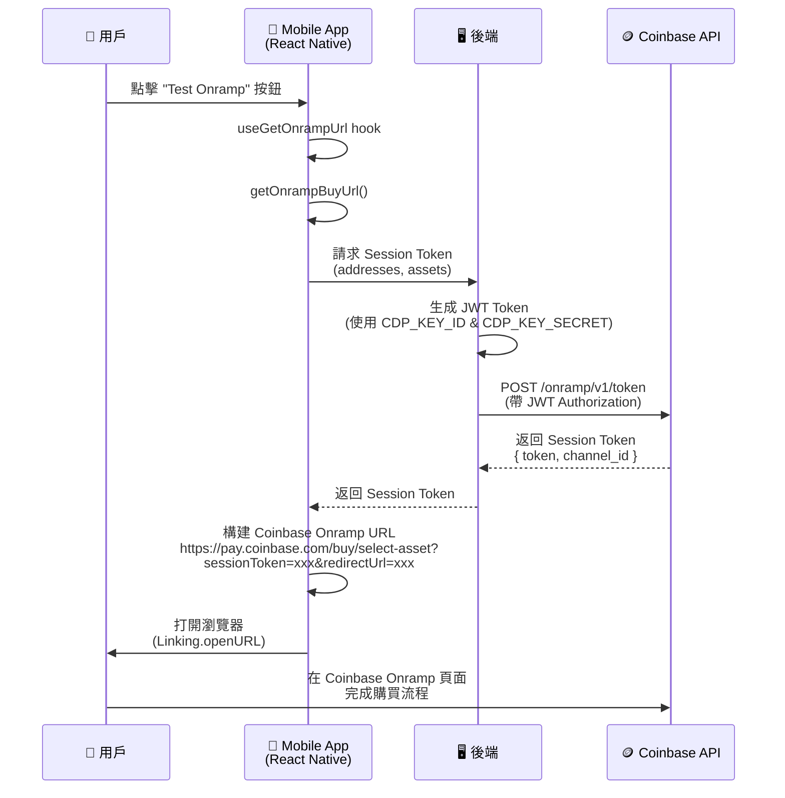
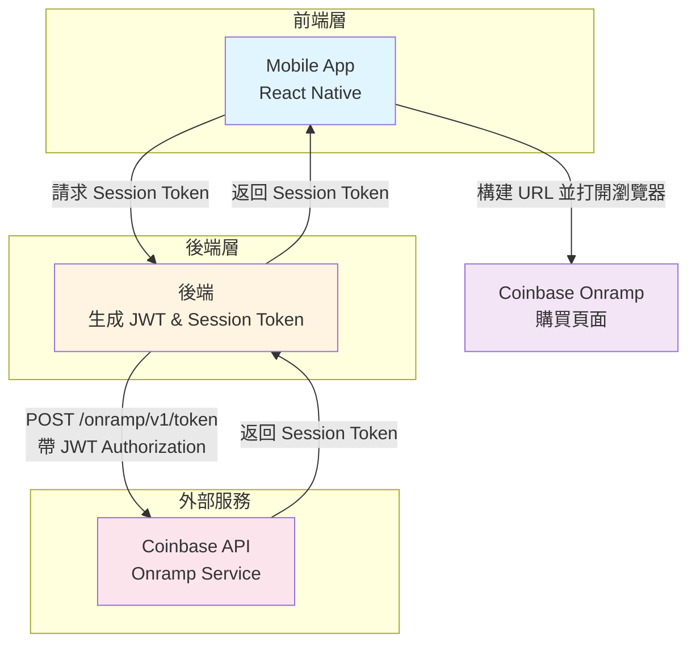
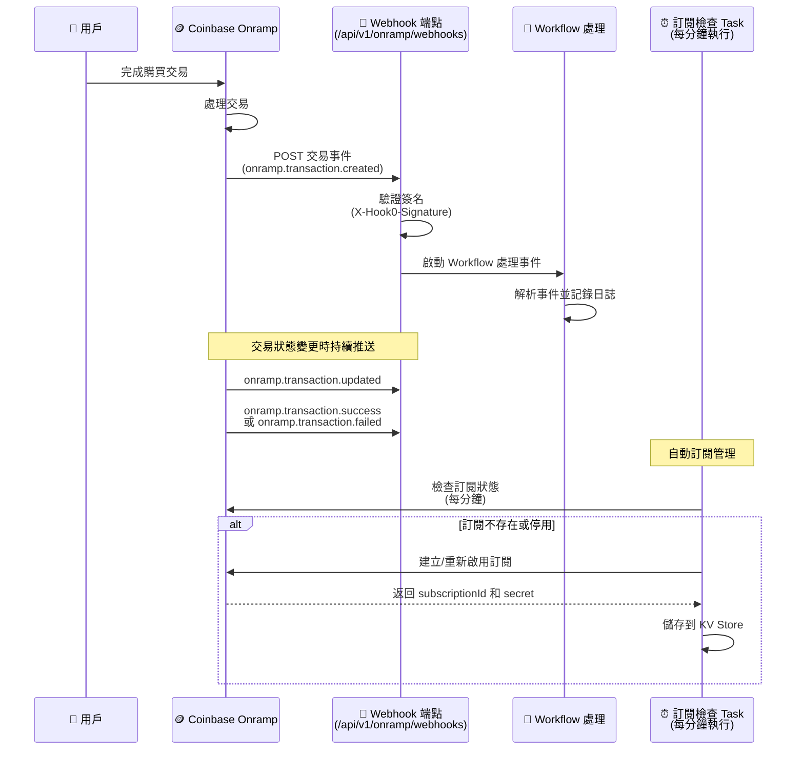

# CoinBase Onramp Demo

## 文件參考

- [Welcome to Onramp & Offramp](https://docs.cdp.coinbase.com/onramp-&-offramp/introduction/welcome)
- [Demo Repo](https://github.com/Chia1104/coinbase-onramp-demo)

## 事前準備

這裡需要先在 [CDP](https://portal.cdp.coinbase.com/) (Coinbase Develop Platform) 建立一個專案，同時在建立一組 API Key，並設定這兩組資訊：

- `CDP_KEY_ID`
- `CDP_KEY_SECRET`

> 請參考官方文檔：[Getting Started with Onramp](https://docs.cdp.coinbase.com/onramp-&-offramp/introduction/getting-started#step-1:-sign-up-for-a-cdp-account)

並新增允許 Redirect domain allowlist

## 流程

### 架構流程圖

### 架構說明

### 流程說明

#### 1. 用戶觸發流程

用戶在 Mobile App 中點擊「Test Onramp」按鈕，觸發購買流程。

#### 2. Mobile App 處理

- Mobile App 使用 `useGetOnrampUrl` hook 來處理請求
- 呼叫 `getOnrampBuyUrl()` 函數，準備要發送到後端的參數
- 參數包含：
  - `addresses`: 目標錢包地址和區塊鏈資訊
  - `assets`: 要購買的加密貨幣（例如：USDC）

#### 3. 後端處理

- 後端接收來自 Mobile App 的請求
- 使用預先設定的 `CDP_KEY_ID` 和 `CDP_KEY_SECRET` 生成 JWT Token
- 使用 JWT Token 向 Coinbase API 發送請求，取得 Session Token
- 請求路徑：`POST /onramp/v1/token`
- 請求標頭包含：`Authorization: Bearer {JWT}`

#### 4. Coinbase API 回應

- Coinbase API 驗證 JWT Token 後，返回 Session Token
- 回應內容包含：
  - `token`: Session Token（用於初始化 Onramp widget）
  - `channel_id`: Channel ID（用於追蹤交易）

#### 5. 構建 Onramp URL

- Mobile App 收到 Session Token 後，構建 Coinbase Onramp 的完整 URL
- URL 格式：`https://pay.coinbase.com/buy/select-asset?sessionToken={token}&redirectUrl={redirectUrl}`
- `redirectUrl` 設定為完成購買後要返回的頁面

#### 6. 打開瀏覽器

- Mobile App 使用 `Linking.openURL()` 打開系統瀏覽器
- 用戶被導向 Coinbase Onramp 購買頁面

#### 7. 完成購買

- 用戶在 Coinbase Onramp 頁面完成購買流程
- 可以選擇支付方式（Coinbase 帳戶餘額、銀行帳戶、信用卡等）
- 完成後，加密貨幣會發送到指定的錢包地址

### Webhook

#### 概述

Webhooks 提供即時的交易狀態更新通知。當用戶完成購買交易後，Coinbase 會主動推送交易狀態變更事件到我們設定的 Webhook 端點，讓後端能夠即時同步交易狀態，無需主動輪詢查詢。

#### Webhook 流程圖

#### 實作架構

##### 1. Webhook 接收端點

- **路徑**：`POST /api/v1/onramp/webhooks`
- **簽名驗證**：使用 `coinbaseHook0SignatureGuard` middleware 驗證 `X-Hook0-Signature` header
- **事件處理**：使用 Workflow 異步處理事件，立即返回 `200` 狀態碼
- **簽名格式**：支援 Hook0 v0 和 v1 簽名格式
- **安全機制**：
  - 驗證時間戳記（防止重放攻擊，最大允許 5 分鐘）
  - 使用 HMAC-SHA256 驗證簽名
  - 使用 timing-safe comparison 防止時序攻擊

##### 2. 自動訂閱管理

系統會自動管理 Webhook 訂閱，無需手動操作：

- **Task 名稱**：`onramp-webhooks-check`
- **執行頻率**：每分鐘執行一次（cron: `* * * * *`）
- **功能**：
  - 檢查訂閱是否存在，不存在則自動建立
  - 檢查訂閱是否啟用，停用則自動重新啟用
  - 自動儲存 `subscriptionId` 和 `secret` 到 KV Store

##### 3. 支援的事件類型

| 事件類型                     | 說明                   | 處理邏輯                             |
| ---------------------------- | ---------------------- | ------------------------------------ |
| `onramp.transaction.created` | 新的 Onramp 交易已建立 | 記錄交易建立日誌                     |
| `onramp.transaction.updated` | Onramp 交易狀態已變更  | 記錄交易更新日誌                     |
| `onramp.transaction.success` | Onramp 交易成功完成    | 記錄交易成功資訊（金額、幣種、網路） |
| `onramp.transaction.failed`  | Onramp 交易失敗        | 記錄失敗原因和詳細資訊               |

##### 4. 事件處理邏輯

Webhook 事件會透過 Workflow 進行處理，目前實作包含：

- **事件解析**：支援多種事件格式（Apple Pay、Widget 等）
- **交易資訊提取**：
  - 交易 ID（支援多種欄位名稱）
  - 購買金額和幣種
  - 目標網路和地址
  - Partner User Reference
- **日誌記錄**：所有事件都會記錄詳細日誌，方便追蹤和除錯

#### 環境設定

Webhook 目標 URL 會根據環境自動設定：

- **生產環境**：`https://coinbase-onramp-demo.zeabur.app/api/v1/onramp/webhooks`
- **開發環境**：`http://localhost:3001/api/v1/onramp/webhooks`

#### 儲存機制

- **KV Store**：使用 KV Store 儲存以下資訊：
  - `onramp-webhooks-subscription-id`：訂閱 ID
  - `onramp-webhooks-secret`：簽名驗證用的 secret

#### 參考文件

- [Webhooks 官方文件](https://docs.cdp.coinbase.com/onramp-&-offramp/webhooks)
- Webhook 訂閱 API：`POST /platform/v2/data/webhooks/subscriptions`
- Webhook 事件範例請參考官方文件中的 Sample transaction event payloads

#### 實作細節

##### 簽名驗證流程

1. 解析 `X-Hook0-Signature` header（格式：`t=timestamp,h=headerNames,v1=signature`）
2. 驗證時間戳記（防止重放攻擊）
3. 構建簽名 payload：`timestamp.headerNames.headerValues.rawBody`
4. 使用 secret 計算 HMAC-SHA256 簽名
5. 使用 timing-safe comparison 比較簽名

##### 事件處理流程

1. 接收 Webhook 請求
2. 驗證簽名（透過 Guard middleware）
3. 啟動 Workflow 異步處理
4. 立即返回 `200` 狀態碼
5. Workflow 解析事件並執行相應處理邏輯

#### 監控與維護

- **自動訂閱檢查**：每分鐘自動檢查訂閱狀態，確保訂閱始終啟用
- **日誌記錄**：所有 Webhook 事件都會記錄詳細日誌
- **錯誤處理**：即使處理失敗也會返回 `200`，避免 Coinbase 重試導致重複處理
