# CoinBase Onramp Demo

## 文件參考

- [Welcome to Onramp & Offramp](https://docs.cdp.coinbase.com/onramp-&-offramp/introduction/welcome)
- [Demo Repo](https://github.com/Chia1104/coinbase-onramp-demo)

## 事前準備

這裡需要先在 [CDP](https://portal.cdp.coinbase.com/) (Coinbase Develop Platform) 建立一個專案，同時在建立一組 API Key，並設定這兩組資訊：

- `CDP_KEY_ID`
- `CDP_KEY_SECRET`

> 請參考官方文檔：[Getting Started with Onramp](https://docs.cdp.coinbase.com/onramp-&-offramp/introduction/getting-started#step-1:-sign-up-for-a-cdp-account)

並新增允許 Redirect domain allowlist

## 流程

### 架構流程圖

```mermaid
sequenceDiagram
    participant User as 👤 用戶
    participant Mobile as 📱 Mobile App<br/>(React Native)
    participant Backend as 🖥️ 後端
    participant Coinbase as 🪙 Coinbase API

    User->>Mobile: 點擊 "Test Onramp" 按鈕
    Mobile->>Mobile: useGetOnrampUrl hook
    Mobile->>Mobile: getOnrampBuyUrl()
    Mobile->>Backend: 請求 Session Token<br/>(addresses, assets)
    Backend->>Backend: 生成 JWT Token<br/>(使用 CDP_KEY_ID & CDP_KEY_SECRET)
    Backend->>Coinbase: POST /onramp/v1/token<br/>(帶 JWT Authorization)
    Coinbase-->>Backend: 返回 Session Token<br/>{ token, channel_id }
    Backend-->>Mobile: 返回 Session Token
    Mobile->>Mobile: 構建 Coinbase Onramp URL<br/>https://pay.coinbase.com/buy/select-asset?<br/>sessionToken=xxx&redirectUrl=xxx
    Mobile->>User: 打開瀏覽器<br/>(Linking.openURL)
    User->>Coinbase: 在 Coinbase Onramp 頁面<br/>完成購買流程
```

### 架構說明

```mermaid
graph TB
    subgraph "前端層"
        A[Mobile App<br/>React Native]
    end

    subgraph "後端層"
        B[後端<br/>生成 JWT & Session Token]
    end

    subgraph "外部服務"
        C[Coinbase API<br/>Onramp Service]
    end

    A -->|請求 Session Token| B
    B -->|POST /onramp/v1/token<br/>帶 JWT Authorization| C
    C -->|返回 Session Token| B
    B -->|返回 Session Token| A
    A -->|構建 URL 並打開瀏覽器| D[Coinbase Onramp<br/>購買頁面]

    style A fill:#e1f5ff
    style B fill:#fff4e1
    style C fill:#fce4ec
    style D fill:#f3e5f5
```

### 流程說明

#### 1. 用戶觸發流程

用戶在 Mobile App 中點擊「Test Onramp」按鈕，觸發購買流程。

#### 2. Mobile App 處理

- Mobile App 使用 `useGetOnrampUrl` hook 來處理請求
- 呼叫 `getOnrampBuyUrl()` 函數，準備要發送到後端的參數
- 參數包含：
  - `addresses`: 目標錢包地址和區塊鏈資訊
  - `assets`: 要購買的加密貨幣（例如：USDC）

#### 3. 後端處理

- 後端接收來自 Mobile App 的請求
- 使用預先設定的 `CDP_KEY_ID` 和 `CDP_KEY_SECRET` 生成 JWT Token
- 使用 JWT Token 向 Coinbase API 發送請求，取得 Session Token
- 請求路徑：`POST /onramp/v1/token`
- 請求標頭包含：`Authorization: Bearer {JWT}`

#### 4. Coinbase API 回應

- Coinbase API 驗證 JWT Token 後，返回 Session Token
- 回應內容包含：
  - `token`: Session Token（用於初始化 Onramp widget）
  - `channel_id`: Channel ID（用於追蹤交易）

#### 5. 構建 Onramp URL

- Mobile App 收到 Session Token 後，構建 Coinbase Onramp 的完整 URL
- URL 格式：`https://pay.coinbase.com/buy/select-asset?sessionToken={token}&redirectUrl={redirectUrl}`
- `redirectUrl` 設定為完成購買後要返回的頁面

#### 6. 打開瀏覽器

- Mobile App 使用 `Linking.openURL()` 打開系統瀏覽器
- 用戶被導向 Coinbase Onramp 購買頁面

#### 7. 完成購買

- 用戶在 Coinbase Onramp 頁面完成購買流程
- 可以選擇支付方式（Coinbase 帳戶餘額、銀行帳戶、信用卡等）
- 完成後，加密貨幣會發送到指定的錢包地址

### Webhook (WIP)

> ⚠️ **注意**：此功能尚未實作，以下為規劃說明

#### 概述

Webhooks 提供即時的交易狀態更新通知。當用戶完成購買交易後，Coinbase 會主動推送交易狀態變更事件到我們設定的 Webhook 端點，讓後端能夠即時同步交易狀態，無需主動輪詢查詢。

#### Webhook 流程圖

```mermaid
sequenceDiagram
    participant User as 👤 用戶
    participant Coinbase as 🪙 Coinbase Onramp
    participant Webhook as 📡 Webhook 端點<br/>(後端)
    participant Backend as 🖥️ 後端服務
    participant Mobile as 📱 Mobile App

    User->>Coinbase: 完成購買交易
    Coinbase->>Coinbase: 處理交易
    Coinbase->>Webhook: POST 交易事件<br/>(onramp.transaction.created)
    Webhook->>Webhook: 驗證簽名<br/>(X-Hook0-Signature)
    Webhook->>Backend: 儲存/更新交易狀態
    Backend->>Mobile: 推送通知<br/>(可選)

    Note over Coinbase,Webhook: 交易狀態變更時持續推送
    Coinbase->>Webhook: onramp.transaction.updated
    Coinbase->>Webhook: onramp.transaction.success<br/>或 onramp.transaction.failed
```

#### 支援的事件類型

| 事件類型                     | 說明                   |
| ---------------------------- | ---------------------- |
| `onramp.transaction.created` | 新的 Onramp 交易已建立 |
| `onramp.transaction.updated` | Onramp 交易狀態已變更  |
| `onramp.transaction.success` | Onramp 交易成功完成    |
| `onramp.transaction.failed`  | Onramp 交易失敗        |

#### 需要實作的功能

1. **Webhook 訂閱管理**
   - 建立 Webhook 訂閱（設定目標 URL 和事件類型）
   - 管理訂閱（查看、更新、刪除）

2. **Webhook 接收端點**
   - 建立 HTTPS 端點接收 Coinbase 的 Webhook 請求
   - 驗證 Webhook 簽名（`X-Hook0-Signature` header）
   - 處理交易事件並更新資料庫

3. **簽名驗證**
   - 使用訂閱建立時獲得的 `secret` 驗證請求真實性
   - 驗證時間戳記以防止重放攻擊

4. **交易狀態同步**
   - 解析 Webhook 事件內容
   - 更新本地交易記錄
   - 可選：推送通知給 Mobile App

#### 參考文件

- [Webhooks 官方文件](https://docs.cdp.coinbase.com/onramp-&-offramp/webhooks)
- Webhook 訂閱 API：`POST /platform/v2/data/webhooks/subscriptions`
- Webhook 事件範例請參考官方文件中的 Sample transaction event payloads

#### 實作注意事項

- Webhook 端點必須使用 HTTPS
- 建議異步處理事件，快速返回 `200` 狀態碼
- 確保端點能夠處理並發請求
- 監控 Webhook 接收健康狀態，避免訂閱被自動停用
